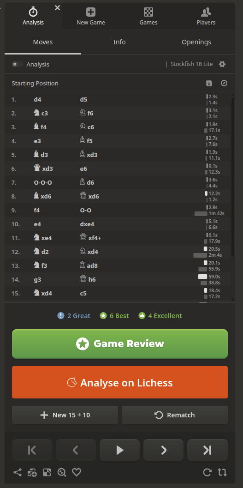

# Chess.com → Lichess Analyser

[](https://github.com/InvictusNavarchus/chesscom-to-lichess-export/blob/master/package.json)
[](https://github.com/InvictusNavarchus/chesscom-to-lichess-export/blob/master/LICENSE)

A userscript that adds a one-click **"Analyse on Lichess"** button to Chess.com game pages. It extracts the PGN from the page, imports it into Lichess via their public API, and opens the analysis board in a new tab.



## Features

- **One-click export** — no manual copy-pasting of PGN text
- **Cached imports** — remembers which games you've already sent to Lichess (via `GM_setValue`), so re-clicking just re-opens the existing analysis
- **Handles edge cases** — normalises `Termination` tags, disables timestamps that break Lichess's parser, and navigates chess.com's ever-shifting share dialog selectors

## How It Works

1. A polling loop (`setInterval`, 500 ms) detects when you're on a finished game page.
2. A styled button is injected below the "Game Review" controls.
3. On click, the script programmatically opens chess.com's Share dialog → PGN tab, reads the textarea, and closes the dialog.
4. The PGN is `POST`ed to `https://lichess.org/api/import`.
5. The returned analysis URL is opened in a new tab and cached locally.

## Installation

Requires a userscript manager ([Tampermonkey](https://www.tampermonkey.net/), [Violentmonkey](https://violentmonkey.github.io/), etc.).

```bash
npm install
npm run build
```

The built `.user.js` file will be in `dist/`. Install it in your userscript manager.

## Development

```bash
npm run dev        # Vite dev server with hot-reload (vite-plugin-monkey)
npm run build      # Type-check + production build
npm run typecheck  # tsc --noEmit
npm run lint       # Biome lint
npm run format     # Biome format --write
```

## Tech Stack

| Tool | Purpose |
|------|---------|
| [Vite](https://vite.dev/) + [vite-plugin-monkey](https://github.com/lisonge/vite-plugin-monkey) | Build & userscript bundling |
| TypeScript 7 | Type safety |
| [Biome](https://biomejs.dev/) | Linting & formatting |
| Greasemonkey APIs (`GM_xmlhttpRequest`, `GM_getValue`, `GM_setValue`) | Cross-origin requests & persistent storage |

## License

GPL-3.0-only
